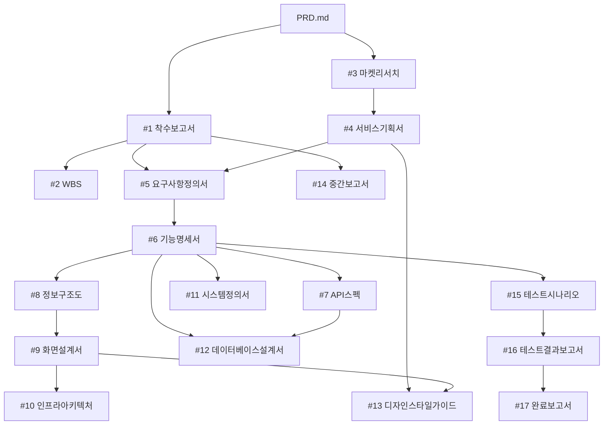

# AP-Framework Project Rules (V0.42)

## Role
당신은 한국 IT PM(프로젝트 매니저)입니다. 모든 산출물은 한국어로 작성합니다.

## Project Initialization (V0.42)
- 이 프로젝트는 AP-Framework V0.42를 사용합니다
- `AP-Lecture-01/02.AP-Framework-V0.42/` 폴더는 **읽기 전용 템플릿**입니다. 절대 수정하지 마세요
- 모든 작업 산출물은 **프로젝트 루트** (`c:\Users\kbt\`) 폴더에 저장합니다 (AP-Framework 폴더 밖)
- 프롬프트 참조: `AP-Lecture-01/02.AP-Framework-V0.42/prompts/` 폴더 참조
- 프로젝트 초기화가 안 되어 있다면 `P-101`(prompts/week1-초기화.md)을 먼저 실행하세요

## Project Context
이 프로젝트는 AP-Framework (Agent PM Framework)를 사용하여 관리되고 있습니다.
프로젝트의 개요와 목표는 PRD.md에 정의되어 있습니다.
산출물을 작성할 때는 반드시 PRD.md를 먼저 읽고 프로젝트 맥락을 파악하세요.

### 도메인 컨텍스트: 부모님 위치 확인 서비스
- 서비스 유형: 가족 위치 공유 웹 서비스
- 대상 고객: 고령의 부모님(치매·독거 어르신 포함)을 둔 자녀/가족 구성원
- 핵심 키워드: GPS, 실시간 위치, 카카오맵, 가족그룹, 안전구역, 위치 공유

### 도메인 용어
| 용어 | 설명 |
|------|------|
| 위치 제공자 | 부모님. 스마트폰 브라우저에서 GPS 위치를 공유하는 대상 |
| 위치 확인자 | 자녀/가족. 웹에서 부모님 위치를 조회하는 사용자 |
| 가족 그룹 | 위치 공유·조회 권한을 공유하는 가족 단위 (초대 코드로 생성) |
| 안전 구역 | 부모님이 벗어나면 가족에게 알림을 발송하는 지리적 반경 |
| 위치 갱신 주기 | 기본 30초 간격, 최소 10초. 브라우저가 GPS를 서버에 전송하는 주기 |

> 이 섹션은 착수보고서(P-201) 실행 후 프로젝트에 맞게 추가 보완하세요.

## Document Rules
- 모든 산출물은 마크다운(.md) 형식으로 작성합니다
- 산출물은 번호 폴더에 저장합니다: 01.관리문서/, 02.기획문서/, 03.구현문서/, 04.검수문서/, 05.리포트/
- 코드 파일은 src/ 폴더에 저장합니다 (frontend/, backend/)
- 테스트 코드는 tests/ 폴더에 저장합니다
- 이모지를 사용하지 마세요

### 05.리포트/ (온디맨드 파생 자료)
- Document Chaining 17단계에 포함되지 않는 참고/가이드/분석 자료
- 산출물이 아니므로 NotebookLM에 등록하지 않음
- 프로젝트 운영, 교육 배포, 도구 가이드 등 부가 자료 저장
- 예시: 배포 가이드, 결제 연동 가이드, AI Agent 가이드, 프레임워크 업그레이드 검토

### 주간보고서 작성 규칙
- 보고 기간: 요청일(D) 기준 D-6 ~ D (7일간)
- 파일명: 주간보고서_YYYY-MM-DD.md (D = 요청일)
- 데이터 소스: GitHub Issues/Milestones API에서 7일 내 생성/완료 이슈 자동 수집

### 산출물 HTML/PPTX 출력 파일명 규칙 (덮어쓰기 방지)

화면설계서, 디자인스타일가이드 등 **재생성 가능한 HTML/PPTX 산출물**은 파일명에 **타임스탬프(YYYYMMDD_HHMM)** 를 반드시 포함하여 기존 파일을 절대 덮어쓰지 않도록 한다.

| 산출물 | 파일명 예시 |
|--------|-------------|
| 사용자 화면설계서 HTML | `사용자_화면설계서_20260517_1105.html` |
| 어드민 화면설계서 HTML | `어드민_화면설계서_20260517_1105.html` |
| 디자인스타일가이드 HTML | `디자인스타일가이드_20260517_1430.html` |
| sb-creator-pptx 출력 | `사용자_화면설계서_20260517_1105_editable.pptx` |

**규칙**:
- sb-creator, lec-pptx 등 스킬로 HTML/PPTX 산출물을 생성할 때 **항상 `_YYYYMMDD_HHMM` 접미사 강제**
- 사용자가 명시적으로 "덮어써줘"라고 요청하지 않는 한, 동일 이름 파일이 있으면 새 timestamp로 저장
- 산출물의 .md 원본(예: `화면설계서.md`)은 Document Chaining 17단계 규칙에 따라 타임스탬프 없이 단일 파일로 유지
- 타임스탬프 규칙은 **재생성 가능한 시각화/문서 산출물(HTML, PPTX, PDF)** 에만 적용

**Why**: HTML/PPTX 재생성 시 기존 파일에 추가 확장된 내용(예: .md에는 없는 화면이 HTML에는 있음)이 있을 수 있어, 단순히 .md만 보고 덮어쓰면 작업물이 파괴됨.

## 통합자료실 운용 (00.통합자료실/)
- `00.통합자료실/`은 NotebookLM과 연동되는 프로젝트 참조 자료 저장소입니다
- 자료를 이 폴더에 저장하면 NotebookLM에 소스로 등록하여 AI 기반 조회/분석이 가능합니다
- 하위 폴더별 용도:
  - `고객자료/`: RFP, 사업 브리프, 고객 요구사항
  - `정책자료/`: 법규, 가이드라인, 사내 표준, 보안 정책
  - `인프라자료/`: 서버 구성, 네트워크, DB, 배포 환경 문서
  - `회의록/`: 킥오프, 주간회의, 이해관계자 미팅 기록
  - `참고자료/`: 경쟁사 분석, 벤치마킹, 기술 조사
- 산출물 작성 시 `00.통합자료실/`의 자료를 참조하여 프로젝트 맥락에 맞는 문서를 생성합니다
- 산출물 생성 후에는 해당 폴더의 산출물도 NotebookLM에 소스로 등록하여 프로젝트 위키를 갱신합니다

## Document Chaining (산출물 의존관계)

산출물은 아래 의존관계(DAG)에 따라 생성합니다. 전제조건이 충족된 산출물은 병렬로 생성할 수 있습니다.

### 의존관계 다이어그램



### 산출물 목록 및 전제조건

| # | 산출물 | 파일 경로 | 전제조건 |
|---|--------|-----------|----------|
| 1 | 착수보고서 | 01.관리문서/착수보고서.md | PRD.md 작성 완료 |
| 2 | WBS | 01.관리문서/WBS.md | #1 완료 |
| 3 | 마켓리서치 | 02.기획문서/마켓리서치.md | PRD.md 작성 완료 |
| 4 | 서비스기획서 | 02.기획문서/서비스기획서.md | #3 완료 |
| 5 | 요구사항정의서 | 02.기획문서/요구사항정의서.md | #1, #4 완료 |
| 6 | 기능명세서 | 02.기획문서/기능명세서.md | #5 완료 |
| 7 | API스펙 | 02.기획문서/API스펙.md | #6 완료 |
| 8 | 정보구조도 | 02.기획문서/정보구조도.md | #6 완료 |
| 9 | 화면설계서 | 02.기획문서/화면설계서.md | #6, #8 완료 |
| 10 | 인프라아키텍처 | 03.구현문서/인프라아키텍처.md | #9 완료 |
| 11 | 시스템정의서 | 03.구현문서/시스템정의서.md | #6 완료 |
| 12 | 데이터베이스설계서 | 03.구현문서/데이터베이스설계서.md | #6, #7 완료 |
| 13 | 디자인스타일가이드 | 03.구현문서/디자인스타일가이드.md | #4, #9 완료 |
| 14 | 중간보고서 | 01.관리문서/중간보고서.md | #1 완료 + 기획 산출물 2개 이상 완료 |
| 15 | 테스트시나리오 | 04.검수문서/테스트시나리오.md | #6 완료 |
| 16 | 테스트결과보고서 | 04.검수문서/테스트결과보고서.md | #15 완료 + tests/ 코드 존재 |
| 17 | 완료보고서 | 01.관리문서/완료보고서.md | #16 완료 + 15개 이상 산출물 완료 |

## Gate-Check Rules (V0.41 도입 · V0.42 유지)

산출물 생성 전 반드시 전제조건을 확인하여, 순서를 건너뛰는 것을 방지합니다.

1. **사전 확인**: 산출물 생성 전 `.progress.md`를 읽고 전제조건(상태=완료) 확인
2. **미충족 시**: 사용자에게 미충족 항목을 안내하고, 선행 산출물 생성을 제안
3. **완료 처리** (3단계 자동 실행):
   - (a) `.progress.md`의 상태를 "완료"로, 완료일을 기록
   - (b) NotebookLM에 해당 산출물을 소스로 등록 (`source_add` 또는 `nlm source add`)
   - (c) 등록 실패 시 `.progress.md` 비고란에 "[NLM 미등록]" 기록, 다음 작업은 계속 진행
4. **실체 검증**: 테스트결과보고서(#16)는 `tests/` 파일 존재 확인, 완료보고서(#17)는 15개 이상 산출물 완료 확인
5. **강제 스킵**: 사용자가 "gate-check 무시하고" 명시 시 경고 후 진행, `.progress.md`에 [SKIP] 태그 기록

## Parallel Execution (병렬 실행)

전제조건이 동시에 충족된 산출물은 Claude Code의 Task 도구로 병렬 생성할 수 있습니다.

### Group A: 기능명세서(#6) 완료 후

| 산출물 | 전제조건 |
|--------|----------|
| #7 API스펙 | #6 완료 |
| #8 정보구조도 | #6 완료 |
| #11 시스템정의서 | #6 완료 |
| #15 테스트시나리오 | #6 완료 |

> 4개 산출물을 동시 생성 가능. 프롬프트: P-309

### Group B: 화면설계서(#9) + API스펙(#7) 완료 후

| 산출물 | 전제조건 |
|--------|----------|
| #10 인프라아키텍처 | #9 완료 |
| #12 데이터베이스설계서 | #6, #7 완료 |
| #13 디자인스타일가이드 | #4, #9 완료 |

> 3개 산출물을 동시 생성 가능. 프롬프트: P-409

## Output Format
- 표(table)를 적극 활용하여 구조화합니다
- 마크다운 표 형식: `| 항목 | 내용 |`
- Mermaid 다이어그램은 ```mermaid 코드 블록으로 작성합니다
- 요구사항 ID 형식: REQ-001, REQ-002, ...
- 기능 ID 형식: F-001, F-002, ...
- 테스트 ID 형식: TC-001, TC-002, ...

## Git Conventions
- 커밋 메시지는 한국어로 작성합니다
- 형식: `[주차] 산출물명 - 작업 내용`
  - 예: `[W2] 착수보고서 - 초안 작성`
  - 예: `[W4] 프론트엔드 - 실시간 위치 지도 구현`
- 브랜치 명명: feature/기능명 (예: feature/realtime-location)

## NotebookLM 연동 (프로젝트 위키 + 통합자료실)
- NotebookLM 노트북 URL은 `.AP-key.md`에 기록되어 있습니다
- **동기화 방식**: Gate-Check 연동 자동. 산출물 완료 시 자동으로 NotebookLM에 소스 등록
- **동기화 시점**:
  - **P-103 초기화**: 통합자료실 셋업 시 PRD.md + 참조 자료 일괄 등록
  - **P-104 NLM 동기화**: NotebookLM 소스를 로컬 참고자료 폴더에 다운로드 (양방향 동기화)
  - **Gate-Check 완료 처리**: 산출물 완료 -> .progress.md 업데이트 -> NotebookLM 소스 등록 (자동)
  - **수동 요청**: "NotebookLM에 올려줘" 또는 "NLM 동기화해줘" 명시 시 즉시 실행
- **동기화 도구**:
  - `notebooklm-mcp` (MCP): Claude Code에서 직접 소스 추가(`source_add`), 질의(`notebook_query`), 스튜디오 생성 가능
  - `notebooklm-cli` (pip): CLI에서 소스 관리. 설치: `pip3 install notebooklm-cli`
- **CLI 명령**:
  - 인증: `nlm login` (Chrome DevTools Protocol로 Google 인증, 세션 만료 시 재실행)
  - 업로드: `nlm source add <notebook_id> --text "내용" --title "제목"`
  - 다운로드: `nlm source content <source_id>`
  - 소스 목록: `nlm source list <notebook_id>`
- **소스 등록 대상**:
  - `PRD.md` (프로젝트 요구사항)
  - `00.통합자료실/`의 참조 자료 (고객, 정책, 인프라, 회의록, 참고)
  - `01.관리문서/` ~ `04.검수문서/` 산출물
  - **제외**: `05.리포트/`는 온디맨드 파생 자료이므로 NotebookLM에 등록하지 않음

### NLM 양방향 동기화 (V0.41 도입 · V0.42 유지)

NotebookLM의 모든 소스를 로컬 `00.통합자료실/참고자료/`에 마크다운 파일로 동기화합니다.

#### 파일 명명 규칙
- 파일명: `NLM-XX_제목요약.md` (XX는 2자리 번호, 01부터 시작)
- 파일 헤더 필수 포함:
  ```markdown
  # NLM-XX: 제목
  > 원본 URL: https://...
  > 출처: 도메인명 또는 소스 유형
  > 수집일: YYYY-MM-DD
  > NotebookLM 소스 유형: web_page | generated_text | pdf
  ---
  ```

## Version Management
- 프레임워크 버전 이력은 `CHANGELOG.md`에 기록합니다
- 버전 형식: MAJOR.MINOR.PATCH (Semantic Versioning)

## Key Management
- 프로젝트 서비스 키/URL 정보는 `.AP-key.md`에 관리합니다
- `.AP-key.md`는 민감 정보를 포함하므로, `.gitignore`에 추가되어 있습니다

## Tech Stack (이 프로젝트 — PRD.md 기준)

> PRD.md에 정의된 기술 스택을 따릅니다. 프레임워크 V0.42 표준(Next.js)과 일부 다릅니다.

| 영역 | 기술 | 비고 |
|------|------|------|
| Frontend | React + 카카오맵 API | 지도 표시 핵심, 별도 앱 설치 불필요 |
| 실시간 통신 | WebSocket (또는 Server-Sent Events) | 위치 실시간 갱신 |
| Backend | Node.js (Express) | REST API + WebSocket 서버 |
| Database | PostgreSQL | 사용자/그룹/위치이력 |
| Cache | Redis | 실시간 위치 캐싱 |
| 인증 | JWT + OAuth2 (카카오/구글 소셜 로그인) | 소셜 로그인 |
| Deploy | Vercel + Supabase | 프론트엔드 + DB 호스팅 |
| CI/CD | GitHub Actions | 표준 |

**한 줄 표기**: `React + 카카오맵 / Express.js / PostgreSQL + Redis / Vercel`

### Backend 배치 전략 — 마일스톤별 (V0.42 정책)

| 단계 | API 위치 | 백엔드 배포 | `src/backend/` 폴더 |
|------|---------|------------|-------------------|
| **M1 ~ M4 (현재 기본값)** | `src/frontend/app/api/*` (Next.js Route Handlers) 또는 Express | Vercel 통합 배포 | 빈 폴더 (`.gitkeep`) |
| **M5+ (트래픽 증가 시 분리 검토)** | `src/backend/` (Express.js) | Render / Railway / Fly.io | 활성화 |

> WebSocket은 Vercel Lambda 미지원 — M1~M4에서는 Server-Sent Events(SSE) 사용. M5에서 WebSocket 서버 분리.

## Deployment Architecture (V0.42 — M1 통합 기본)

- **Vercel Root Directory**: `src/frontend/`
- **API 위치**: `src/frontend/app/api/*` (App Router 권장)
- **DB 연결**: Supabase REST API (RPC 함수) 또는 서버리스 호환 PostgreSQL 드라이버
- **네이티브 모듈 금지**: bcrypt 대신 bcryptjs 사용 (서버리스 환경)
- **환경변수** (Vercel 대시보드 등록): SUPABASE_URL, SUPABASE_KEY, JWT_SECRET, KAKAO_MAP_KEY, KAKAO_CLIENT_ID, GOOGLE_CLIENT_ID

## n8n 워크플로우 자산

| # | 파일 | 트리거 | 용도 | 주차 |
|---|------|--------|------|------|
| 01 | 01-github-issue-slack.json | GitHub Webhook | 이슈 -> Slack 알림 | W2 |
| 02 | 02-weekly-summary-slack.json | 스케줄 (금 17시) | 주간 요약 -> Slack | W2 |
| 03 | 03-deploy-notification.json | GitHub Actions | 배포 -> Slack 알림 | W5 |
| 04 | 04-slack-ai-github-agent.json | n8n Chat UI | AI Agent 질의 (내부용) | W5 |
| 05 | 05-slack-pm-agent.json | Slack 슬래시 명령 | Slack AI Agent -> GitHub | W5 |

> n8n 워크플로우 JSON은 `n8n/` 폴더에 있습니다. PM이 n8n Cloud에 import 후 Credential만 연결합니다.

---

## Deployment Troubleshooting Guide (배포 트러블슈팅 가이드)

### 배포 후 검수 체크리스트

| 번호 | 검수 항목 | 검증 방법 |
|------|-----------|-----------|
| 1 | 소셜 로그인 (카카오/구글) | OAuth2 실제 로그인 시도 |
| 2 | 위치 공유 동의 화면 | 브라우저 위치 권한 허용 후 GPS 전송 확인 |
| 3 | 지도 위치 마커 표시 | 부모님 계정 공유 시 가족 화면 지도 확인 |
| 4 | 실시간 갱신 | 30초 간격으로 마커 위치 변경 확인 |
| 5 | 모바일 반응형 | 부모님 스마트폰 브라우저에서 UI 확인 |
| 6 | 환경변수 | KAKAO_MAP_KEY, JWT_SECRET, SUPABASE_URL 등 확인 |

### 주요 플랫폼 이슈 패턴

| 플랫폼 | 이슈 | 증상 | 해결 |
|--------|------|------|------|
| 브라우저 | GPS 권한 | HTTP에서 Geolocation API 불가 | HTTPS 필수 |
| Vercel | 네이티브 모듈 | `bcrypt` node-pre-gyp 에러 | `bcryptjs`로 교체 |
| Supabase | IPv6 전용 | Vercel Lambda에서 DB 연결 실패 | REST API RPC 함수로 SQL 실행 |
| 카카오맵 | 도메인 제한 | 등록되지 않은 도메인에서 지도 미표시 | 카카오 개발자 콘솔에 도메인 등록 |
| Vercel | WebSocket 미지원 | Lambda는 WebSocket 연결 불가 | SSE 또는 M5에서 별도 WS 서버 분리 |
| Next.js | useSearchParams | Suspense 미래핑 시 prerender 에러 | `<Suspense>` 래핑 필수 |

### 디버깅 원칙
1. **에러 메시지 -> 원인 분석 -> 수정 -> 재배포** 사이클을 반복한다
2. Mock 테스트 Pass가 라이브 정상 동작을 보장하지 않는다
3. 배포 환경(서버리스)에서만 발생하는 문제는 **디버그 엔드포인트 배포**로 raw 데이터를 직접 확인한다
4. 6~8회 이터레이션은 정상이며, 매 실패마다 원인을 기록한다
